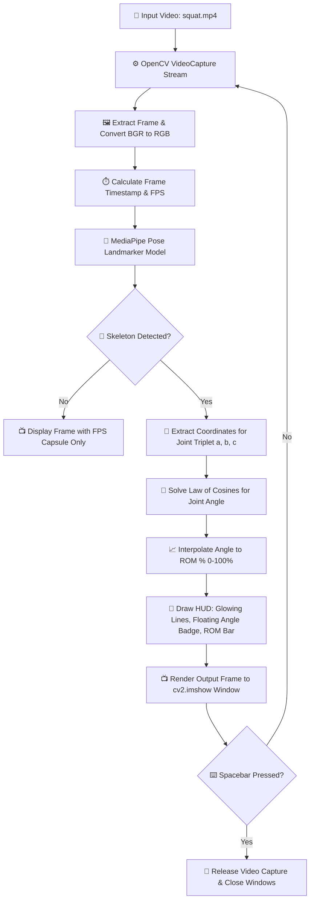

# 🏋️‍♂️ GYM Range-Of-Motion (ROM) Computer Vision Tracker

<div align="center">

[](https://www.python.org/)
[](https://mediapipe.dev/)
[](https://opencv.org/)
[](#)

A modern, high-precision computer vision pipeline designed to track, measure, and visualize joint range of motion (ROM) in real-time during exercise video playback. Built with MediaPipe's Pose Landmarker API and OpenCV, it features a custom, highly aesthetic HUD showing real-time biomechanics angles, contractive percentages, and live performance metrics.

---

[🚀 Overview](#-project-overview) • [🏗️ Architecture](#%EF%B8%8F-architecture--flow-scheme) • [📂 Directory Structure](#-directory-structure) • [📄 File Details](#-file-details) • [🧮 How It Works](#-how-it-works-core-logic) • [🛠️ Setup & Requirements](#%EF%B8%8F-setup--requirements) • [🎮 Controls & Usage](#-controls--usage)

</div>

---

## 🚀 Project Overview

The **GYM Range-Of-Motion Tracker** allows fitness enthusiasts, coaches, and physiotherapists to analyze exercise forms quantitatively. By tracking coordinate points of key anatomical landmarks, the application:
*   🎥 Processes fitness video recordings (e.g., Squats, Bicep Curls).
*   🦴 Detects and tracks 33 critical skeletal landmarks using the optimized **MediaPipe Pose Landmarker** model.
*   📐 Calculates dynamic joint angles in real-time using trigonometry.
*   📊 Renders a stylized, clean Heads-Up Display (HUD) including a glowing skeleton overlay, floating angular badge, contraction progress bar, and real-time FPS capsule.

---

## 🏗️ Architecture & Flow Scheme

The pipeline processes video frames sequentially, passing them through pre-processing, landmark prediction, mathematical coordinate mapping, HUD overlay generation, and final visual rendering:



---

## 📂 Directory Structure

Here is the clean, tree-like structure of the project workspace:

```text
GYM-Range-Of-Motion-CV/
├── .gitignore
├── requirements.txt
├── readme.md
├── main.py
├── utils.py
├── videos/
│   └── squat.mp4
└── Pose_Tracking_Model/
    ├── Landmarks.png
    ├── pose_landmarker_full.task
    └── utils.py
```

---

## 📄 File Details

Below is the detailed breakdown of each file, its purpose, and its exact role within the system:

*   📂 **Root Configurations & Runnables**:
    *   📄 [main.py](file:///Users/wess/Desktop/computer%20vision/GYM-Range-Of-Motion-CV/main.py): The main application driver. Handles the OpenCV video reading loop, coordinates timestamp calculation, manages state for the pose landmarker, coordinates helper utility calls, and prints min/max angles reached upon completion.
    *   📄 [utils.py](file:///Users/wess/Desktop/computer%20vision/GYM-Range-Of-Motion-CV/utils.py): Core math and rendering module containing custom-drawn HUD widgets like the glowing skeleton, floating angle badge, dynamic range-of-motion progress bar, and the FPS tracker capsule.
    *   📄 [requirements.txt](file:///Users/wess/Desktop/computer%20vision/GYM-Range-Of-Motion-CV/requirements.txt): Lists external dependencies required to run the pipeline (`mediapipe`, `opencv-python`).
    *   📄 [.gitignore](file:///Users/wess/Desktop/computer%20vision/GYM-Range-Of-Motion-CV/.gitignore): Version control filter to exclude the python virtual environment (`.venv`) and temporary caches from Git.

*   📂 **Pose Tracking Module**:
    *   📄 [Pose_Tracking_Model/utils.py](file:///Users/wess/Desktop/computer%20vision/GYM-Range-Of-Motion-CV/Pose_Tracking_Model/utils.py): Contains the wrapper class `PoseDetector`, responsible for loading MediaPipe options, creating the landmarker object in `RunningMode.VIDEO`, extracting landmarks into screen-pixel lists `[ID, cx, cy]`, and optional default rendering.
    *   📄 [Pose_Tracking_Model/pose_landmarker_full.task](file:///Users/wess/Desktop/computer%20vision/GYM-Range-Of-Motion-CV/Pose_Tracking_Model/pose_landmarker_full.task): The pre-trained MediaPipe Pose Landmarker binary file.
    *   🖼️ [Pose_Tracking_Model/Landmarks.png](file:///Users/wess/Desktop/computer%20vision/GYM-Range-Of-Motion-CV/Pose_Tracking_Model/Landmarks.png): A reference illustration showing the 33 body joint IDs defined by the MediaPipe Pose model.

---

## 🧮 How It Works (Core Logic)

The biomechanical analysis works through a clean combination of spatial coordinate math and interactive rendering configurations:

### 1. Spatial Geometry & Angle Calculation
To measure the exact degree of contraction for a joint (e.g. knee joint using the hip `a`, knee `b`, and ankle `c`), we use the coordinates in 2D space. 

1. **Calculate Distances** ($d$) between joints using the Euclidean distance:
   $$d(p_1, p_2) = \sqrt{(x_2 - x_1)^2 + (y_2 - y_1)^2}$$
   Implemented inside [get_dist()](file:///Users/wess/Desktop/computer%20vision/GYM-Range-Of-Motion-CV/utils.py#L24-L25).

2. **Calculate the Joint Angle** ($\theta$) using the **Law of Cosines**:
   $$c^2 = a^2 + b^2 - 2ab \cdot \cos(\theta)$$
   $$\theta = \arccos\left(\frac{a^2 + b^2 - c^2}{2ab}\right)$$
   Where:
   *   $a = \text{distance}(id1, id2)$
   *   $b = \text{distance}(id2, id3)$
   *   $c = \text{distance}(id1, id3)$
   *   The angle $\theta$ is converted from radians to degrees. Implemented inside [get_angle()](file:///Users/wess/Desktop/computer%20vision/GYM-Range-Of-Motion-CV/utils.py#L28-L34).

---

### 2. Range of Motion Mapping
To show the percentage contraction, the current angle is dynamically mapped to a user-defined physical limit:
```python
rom_percentage = np.interp(angle, (min_angle, max_angle), (100, 0))
```
*   **Fully Extended ($160^\circ$)**: Maps to $0\%$ progress (minimum contraction).
*   **Fully Contracted ($30^\circ$)**: Maps to $100\%$ progress (maximum contraction).
*   **Bar Highlight Feedback**: When the ROM percentage is above $80\%$, the progress bar turns green, confirming target contraction depth has been reached!

---

## 🛠️ Setup & Requirements

### Prerequisites
*   Python 3.9, 3.10, or 3.11 installed.
*   A webcam or pre-recorded video file (e.g., placed in a `videos/` folder).

### Step-by-Step Installation

1. **Clone the Repository**:
   ```bash
   git clone <your-repository-url>
   cd GYM-Range-Of-Motion-CV
   ```

2. **Create and Activate a Virtual Environment**:
   ```bash
   # On macOS/Linux
   python3 -m venv .venv
   source .venv/bin/activate

   # On Windows
   python -m venv .venv
   .venv\Scripts\activate
   ```

3. **Install Dependencies**:
   ```bash
   pip install --upgrade pip
   pip install -r requirements.txt
   ```

4. **Verify the Model Path**:
   Ensure `pose_landmarker_full.task` is located under [Pose_Tracking_Model/](file:///Users/wess/Desktop/computer%20vision/GYM-Range-Of-Motion-CV/Pose_Tracking_Model/).

5. **Run the Tracker**:
   ```bash
   python main.py
   ```

---

## 🎮 Controls / Usage

*   🔑 **Spacebar (` `)**: Press the spacebar key on your keyboard while the video window is focused to stop the program, close all active windows, and output the tracking summary.
*   📊 **Terminal Output**: When closed, the program prints the maximum and minimum angles calculated during the tracking process, representing the bounds of your workout set.
    ```text
    # Example Output
    165.8939262442684 45.85509739626673
    ```
*   📐 **Configuring Joint IDs**:
    To track different joints, modify the index values in [main.py](file:///Users/wess/Desktop/computer%20vision/GYM-Range-Of-Motion-CV/main.py#L16-L18):
    *   **Squat Knee (Left)**: `a = 23` (Hip), `b = 25` (Knee), `c = 27` (Ankle).
    *   **Bicep Curl (Left)**: `a = 11` (Shoulder), `b = 13` (Elbow), `c = 15` (Wrist).
